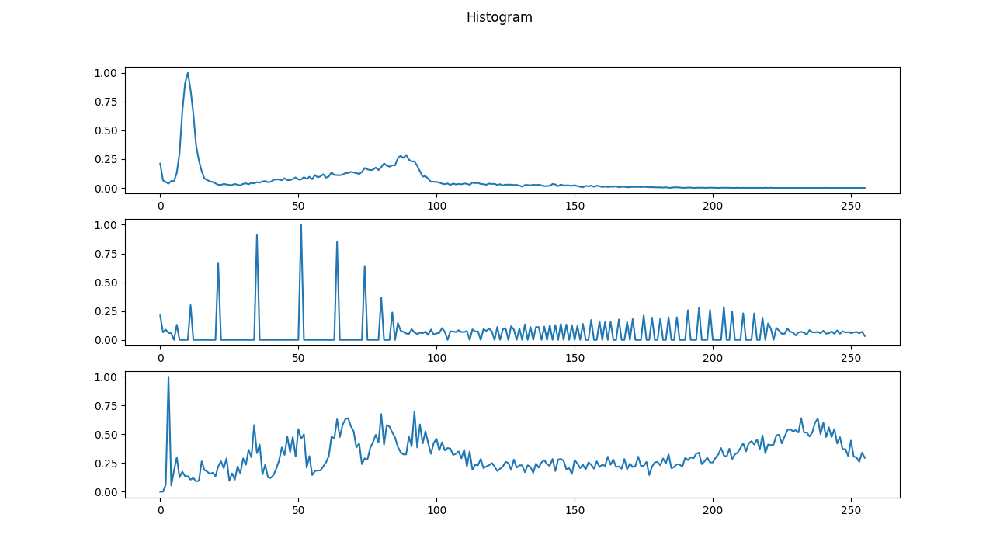

# Python Computer Vision

> Project for class of computer vision post graduate

## Concepts

- Histogram
- FFT
- Filters
- Binary
- HOG
- LBP

### Histogram

### Results Train 1
Without filters

#### HOG

=== Metrics Naive === 

| metrics         |            results |
|:----------------|-------------------:| 
| accuracy_score  | 0.6834477498093059 |
| precision_score | 0.6524426501741896 |
| recall_score    |  0.666374364560639 |
| f1_score        | 0.6518675387518703 |

=== Metrics NKK ===

| metrics         |            results |
|:----------------|-------------------:| 
| accuracy_score  | 0.9290617848970252 |
| precision_score | 0.9306106017803727 |
| recall_score    | 0.9253885257806826 |
| f1_score        | 0.9252177610626369 |

=== Metrics SVM ===

| metrics         |            results |
|:----------------|-------------------:| 
| accuracy_score  | 0.9672006102212052 |
| precision_score | 0.9659173993204839 |
| recall_score    | 0.9644281045751634 |
| f1_score        | 0.9649075223144012 |

#### LBP

=== Metrics Naive ===

| metrics         |             results |
|:----------------|--------------------:|
| accuracy_score  | 0.45461479786422576 |
| precision_score |  0.5094868028597436 |
| recall_score    | 0.48101307189542486 |
| f1_score        |  0.4340824827157281 |

=== Metrics KNN ===

| metrics         |            results |
|:----------------|-------------------:|
| accuracy_score  | 0.8321891685736079 |
| precision_score | 0.8227714849922938 |
| recall_score    | 0.8249818445896877 |
| f1_score        | 0.8233397076167709 |

=== Metrics SVM ===

| metrics         |             results |
|:----------------|--------------------:|
| accuracy_score  |  0.6414950419527079 |
| precision_score |  0.6552621557917319 |
| recall_score    |   0.640622730573711 |
| f1_score        |  0.6391266670652114 |
